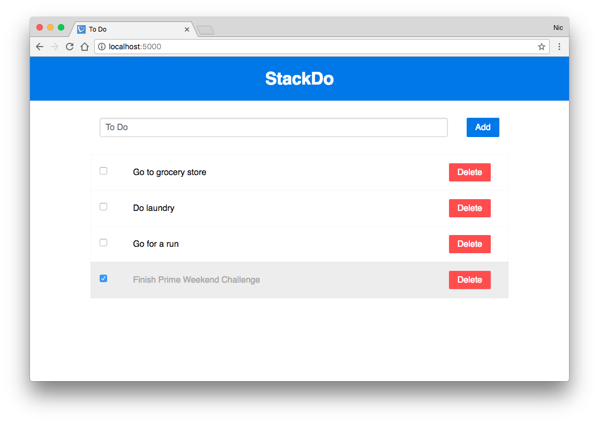

# StackDo

This was our third Weekend Challenge at Prime Digital Academy.

The assignment for this project was to create a To Do application using the full stack.

## Technologies Used

* Database
  * PostgreSQL

* Server-side
  * NodeJS
  * Express
  * PG

* Front-end
  * HTML
  * CSS
  * JavaScript
  * jQuery
  * jQuery UI
  * [Pure.css](https://purecss.io/)

## Preview

## Getting Started

To run the project locally clone the repo to your machine. Run `npm install`.

You'll need to update the PG config in `server/modules/todo.js` to point to your own local Postgres DB and create a table using the `CREATE TABLE` query in `todo_create_database.sql`.

Once your local database is setup and running you can run `npm start` and view the app running on `localhost:5000`.
